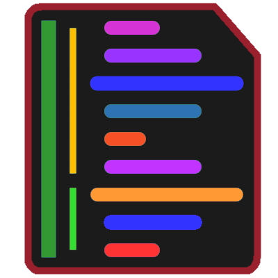
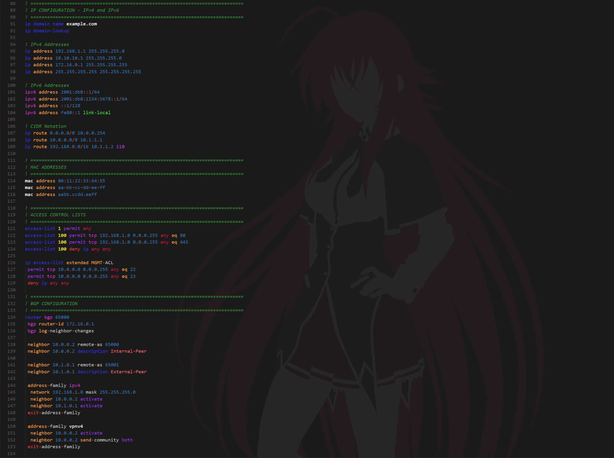
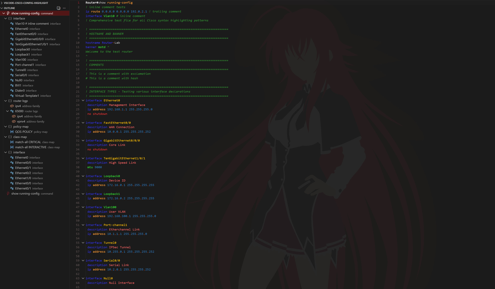

<h1 align="center">
  <a href="https://github.com/CantiFirestarter/vscode-cisco-config-highlight-redux">
    
  </a><br>
    Cisco Config Highlight: Redux
</h1>
<p align="center">Cisco device configuration Syntax Highlighting for Visual Studio Code.</p>

This is a Fork of [Y-Ysss/vscode-cisco-config-highlight](https://github.com/Y-Ysss/vscode-cisco-config-highlight). No credit is taken from the original work. Implemented changes from the main repository of this extension are intended to improve on it and the only part credit is taken.

## Introduction

I'm new at this, so there may be some inconsistencies in documentation as I make changes from main fork of this extension.

I also hope to make further improvement and functionality to the extension as a whole as I'm able to do so.

> [!NOTE]  
> Changes (v0.6 → v0.7)
>
> Version 0.7 includes significant improvements to syntax highlighting, enhanced keyword recognition with case-insensitive matching, and a new token color customization system.
>
> **Major Updates:**
>
> - Modern tooling: ESLint v9, TypeScript v5.9, VS Code API v1.107.0+
> - Enhanced syntax patterns with case-insensitive matching
> - New semantic token color customization framework
> - Improved interface type and address pattern recognition
> - Comprehensive default color theme configuration
> - Better code organization and maintainability
>
> For detailed changes, please refer to [CHANGELOG.md](CHANGELOG.md)

## Features

This extension provides some awesome features for Cisco config text, including:

- Syntax highlighting
- Config outline (Experimental)

## Installation

The extension for VS Code is available on the Visual Studio Marketplace:

- [Visual Studio Marketplace - Cisco Config Highlight: Redux](https://marketplace.visualstudio.com/items?itemName=CantiFirestarter.cisco-config-highlight-redux)

## Supported Platforms

Syntaxes commonly used in configuration files are supported.

- IOS

The following platforms provide similar syntax highlighting for constructs that overlap with IOS:

- NXOS
- IOS-XR
- IOS-XE
- ASA

> [!NOTE]
> Cisco IOS syntax categorization is expansive in scope. For this reason, syntax coverage is a work in progress.

## Screenshot

Note: Screenshots are using a custom theme ([CantiFirestarter/Daybreak Asuna Theme](https://marketplace.visualstudio.com/items?itemName=CantiFirestarter.vscode-daybreak-asuna-theme)).


## Token Color Customizations

The extension automatically applies token colors on activation. Configure colors via extension settings or by editing `settings.json` directly. For best results with custom themes, see [VS Code Color Themes](https://code.visualstudio.com/docs/getstarted/themes).

**Two ways to customize:**

1. **Extension settings (recommended):** Use `cisco-config-highlight.colors.*` keys—simple, fast, and syncs automatically.

> [!NOTE]
> Not all tokens have been reviewed for color allotment.\
> Unreviewed tokens use interim value of white `#ffffff`.

2. **Manual textMateRules:** Use `editor.tokenColorCustomizations` for advanced styling (bold, italic, underline) and fine-grained control.

Both methods work together; your textMateRules are preserved and can override extension colors when needed.

### Quick Setup

- Enable defaults: turn on `cisco-config-highlight.applyAllTokenRules` to load the extension’s baseline colors.
- Customize colors fast: set keys under `cisco-config-highlight.colors.*` (e.g. `interface.ethernet`, `address.ipv4`, `keyword.vlan`). These map to the scopes listed below.
- Discover scopes: run “Developer: Inspect Editor Tokens and Scopes” and click a token in a Cisco file to copy its scope.
- Fine-tune with theme rules: add `editor.tokenColorCustomizations.textMateRules` entries for `foreground` and `fontStyle` where needed. Your rules override defaults; extension-managed colors follow your settings.

### Scope Hierarchy

Tokens follow a hierarchical structure, which allows you to abbreviate scopes when customizing them.

For example, consider the following two scopes:

- `entity.name.class.interface.ethernet`
- `entity.name.class.interface.loopback`

If you specify these scopes in full, the customization will apply only to those specific tokens.

However, if you use a higher-level scope such as:

- `entity.name.class.interface`

The customization will apply to all tokens under that scope.
The higher (shallower) the level in the hierarchy, the broader the range of tokens affected.

### Configure via Extension Settings

In v0.7+, the extension reads `cisco-config-highlight.colors.*` settings and `applyAllTokenRules` to apply colors automatically on startup and when config changes.

Example `settings.json`:

```json
    "cisco-config-highlight.applyAllTokenRules": true,
    "cisco-config-highlight.colors": {
        "interface.ethernet": "#328f16",
        "interface.loopback": "#33df33",
        "address.ipv4": "#2e74b5",
        "keyword.permit": "#9933ff",
        "keyword.deny": "#ff3333",
        "comment": "#339933"
    }
```

- **Enable defaults:** Turn on `applyAllTokenRules` to load sensible default colors.
- **Override:** Set keys under `colors.*` to customize. These override defaults.
- **Real-time:** Changes apply on save; or run "Cisco Config: Apply Token Colors" from the Command Palette.

## Token Scopes List

```
comment.block.banner
comment.line.config

constant.numeric.hex
constant.numeric.integer
constant.numeric.ipv4-AD
constant.numeric.ipv6-AD

entity.name.class.interface.app
entity.name.class.interface.async
entity.name.class.interface.bri
entity.name.class.interface.bvi
entity.name.class.interface.cellular
entity.name.class.interface.dialer
entity.name.class.interface.ethernet
entity.name.class.interface.loopback
entity.name.class.interface.management
entity.name.class.interface.null
entity.name.class.interface.portchannel
entity.name.class.interface.serial
entity.name.class.interface.tunnel
entity.name.class.interface.virtual-template
entity.name.class.interface.vlan
entity.name.class.interface.wireless
entity.name.class.vrf.declaration

entity.name.tag.acl.access-class.name
entity.name.tag.acl.access-group.name
entity.name.tag.acl.access-list.name

entity.name.tag.bgp.neighbor-peer-group.name
entity.name.tag.bgp.peer-group.name
entity.name.tag.bgp.peer-policy.name
entity.name.tag.bgp.peer-session.name

entity.name.tag.config-string.domain-name
entity.name.tag.config-string.hostname
entity.name.tag.config-string.logging-system-message
entity.name.tag.config-string.name
entity.name.tag.config-string.username

entity.name.tag.crypto.crypto-map.name
entity.name.tag.crypto.ipsec-profile.name
entity.name.tag.crypto.isakmp-profile.name
entity.name.tag.crypto.keyring.name
entity.name.tag.crypto.transform-set.name

entity.name.tag.group.class-map.name
entity.name.tag.group.class.name
entity.name.tag.group.community.name
entity.name.tag.group.object-group.name
entity.name.tag.group.policy-list.name
entity.name.tag.group.policy-map.name
entity.name.tag.group.pool.name
entity.name.tag.group.prefix-list.name
entity.name.tag.group.route-map.name
entity.name.tag.group.service-policy.name
entity.name.tag.group.traffic-filter.name

entity.name.tag.vrf.vrf-name
entity.other.vrf.definition
entity.other.vrf.forwarding

keyword.other.acl.access-class.type
keyword.other.acl.access-group.type
keyword.other.acl.access-list.type

keyword.other.address.cidr
keyword.other.address.ipv4.full
keyword.other.address.ipv6.condensed
keyword.other.address.ipv6.full
keyword.other.address.mac

keyword.other.config-keyword.add-remove.add
keyword.other.config-keyword.add-remove.except
keyword.other.config-keyword.add-remove.remove
keyword.other.config-keyword.allowed-native
keyword.other.config-keyword.any-all.all
keyword.other.config-keyword.any-all.any
keyword.other.config-keyword.group1
keyword.other.config-keyword.group2
keyword.other.config-keyword.group3
keyword.other.config-keyword.group4
keyword.other.config-keyword.group5
keyword.other.config-keyword.group6
keyword.other.config-keyword.in-out.in
keyword.other.config-keyword.in-out.out
keyword.other.config-keyword.input-output.input
keyword.other.config-keyword.input-output.output
keyword.other.config-keyword.inside-outside.inside
keyword.other.config-keyword.inside-outside.outside
keyword.other.config-keyword.match.all
keyword.other.config-keyword.match.any
keyword.other.config-keyword.permit-deny.deny
keyword.other.config-keyword.permit-deny.permit
keyword.other.config-keyword.remark
keyword.other.config-keyword.shutdown
keyword.other.config-keyword.status.administratively-down
keyword.other.config-keyword.status.deleted
keyword.other.config-keyword.status.down
keyword.other.config-keyword.status.up
keyword.other.config-keyword.switchport-mode.access
keyword.other.config-keyword.switchport-mode.dynamic
keyword.other.config-keyword.switchport-mode.trunk
keyword.other.config-keyword.vlan
keyword.other.group.object-group.type

meta.function-call.arp-insp-val
meta.function-call.command-disable.default
meta.function-call.command-disable.unused
meta.function-call.command_hostname.privileged-mode
meta.function-call.command_hostname.user-mode

punctuation.config-param.first
punctuation.config-param.second
punctuation.separator

string.other.description
string.other.password
string.other.remark
string.other.secret
```

## Experimental Features

- Show symbols in outline panel
- Multilingual support (settings page)

### Show symbols in outline panel



Open the settings and enter a keyword in the search box. Select the check box to enable.

```
@ext:cantifirestarter.cisco-config-highlight-redux showSymbolsInOutlinePanel
```

#### Supported symbols

- Command
  - `hostname#{command name}`
  - `hostname>{command name}`
- Virtual Routing and Forwarding(VRF)
  - `ip vrf {vrf-name}`
- Border Gateway Protocol(BGP)
  - `router bgp {autonomous-system-number}`
  - `address-family ipv4 {unicast|multicast|vrf vrf-name }`
- Group
  - `class-map {match-any|match-all} name`
  - `policy-map {name}`
- Interface
  - `interface {type, slot, port, etc...}`
  - e.g. `interface GigabitEthernet0/0`
- Sub Interface
  - `interface {type, slot, port, etc...}.{number}`

### Multilingual support

Currently, only the settings page is available.

Following supported languages:

- English
- Japanese

## Notes

### Highlighting in large files

If you want to enable highlighting in large files. Change the following settings to False.

```
"editor.largeFileOptimizations": false
```

However VSCode disable feature on large files for performance reasons, and forcing VSCode to syntax highlight large files may result in poor editor performance.

## Recommended Extensions

I recommend the following extensions to more beautiful look.

- [Y-Ysss/Daybreak Theme](https://marketplace.visualstudio.com/items?itemName=Y-Ysss.vscode-daybreak-theme)
- [Jarvis Prestidge/Sublime Material Theme](https://marketplace.visualstudio.com/items?itemName=jprestidge.theme-material-theme)
- [CantiFirestarter/Daybreak Asuna Theme](https://marketplace.visualstudio.com/items?itemName=CantiFirestarter.vscode-daybreak-asuna-theme)

## Requests or Issues

If you have any requests or issues, please start an Issue or PullRequest on GitHub.

[GitHub - CantiFirestarter/vscode-cisco-config-highlight-redux](https://github.com/CantiFirestarter/vscode-cisco-config-highlight-redux)

## License

MIT License Copyright (c) 2021 Original Y-Ysss\
MIT License Copyright (c) 2026 Fork CantiFirestarter
